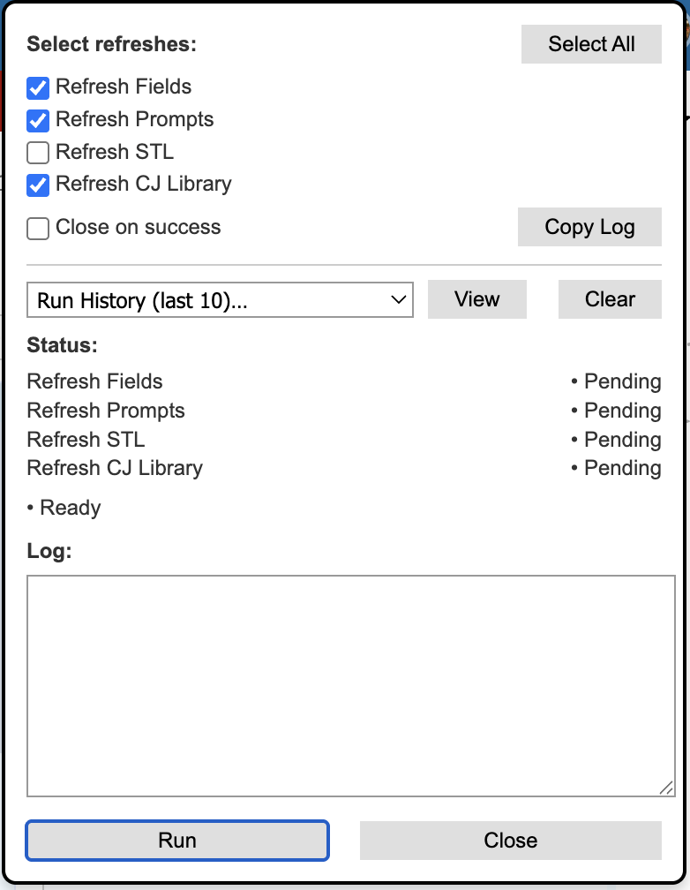
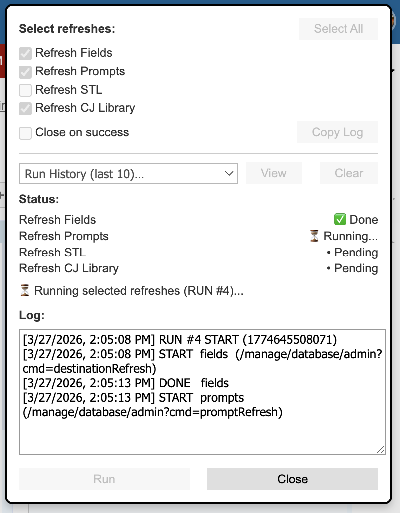
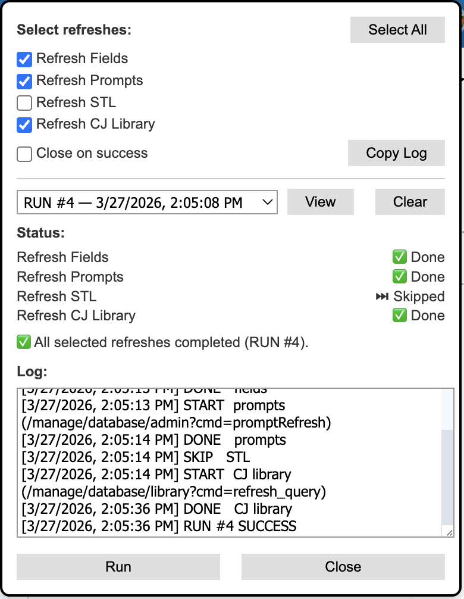

# Slate "Refresh All the Things" Bookmarklet


A powerful, browser-based bookmarklet for running common **Slate database refresh operations** with a clean UI, logging, and persistent history. It keeps admins from having to navigate to multiple pages within the admin console.

---

## Features

- One-click refresh UI  
- Select All / None toggle  
- Per-refresh status tracking  
- Live log output (copyable)  
- Copy log to clipboard  
- Persistent run history (last 10 runs)  
- Automatic Run # counter  
- View previous runs  
- Clear history  
- Preferences saved across sessions  
- Runs only on valid Slate pages  

---

## Screenshot






---

## Supported Refresh Actions

| Action | Endpoint |
|------|--------|
| Refresh Fields | `/manage/database/admin?cmd=destinationRefresh` |
| Refresh Prompts | `/manage/database/admin?cmd=promptRefresh` |
| Refresh STL | `/manage/database/library?cmd=refresh` |
| Refresh CJ Library | `/manage/database/library?cmd=refresh_query` |

---

## How It Works

This bookmarklet:

1. Verifies you're authenticated on a Slate page (`window.FW`)
2. Injects a floating UI panel into the page
3. Lets you select refresh operations
4. Executes them **sequentially** for safer, predictable behavior
5. Logs results and stores them in `localStorage`

---

##Installation

1. Create a new bookmark in your browser  
2. Paste the **minified bookmarklet code** into the URL field  
3. Name it something like:

Slate Refresh Tool

4. Click it while on a Slate admin page

---

## Usage

1. Open a Slate page  
2. Click the bookmarklet  
3. Select desired refresh options  
4. Click **Run**

### Optional behaviors

- Uncheck **Close on success** to keep the panel open  
- Use **Copy Log** to export results  
- Use **Run History** to review past executions  

---

## Persistent Storage

All data is stored per-domain using `localStorage`.

### Run History (last 10 runs)

Each run stores:

- Run number
- Timestamp
- Selected actions
- Result per action (`done`, `skipped`, or `failed`)
- Full log output

### Preferences

- Selected refresh options
- Close-on-success setting

---

## Reset Stored Data

If you want a clean slate:

### Clear preferences

```javascript
localStorage.removeItem("slateRefreshBookmarklet.preferences.v1");
```

### Clear run history

```javascript
localStorage.removeItem("slateRefreshBookmarklet.history.v1");
```

---

## Requirements

- Must be run on an authenticated **Slate page**
- Requires:
  - `window.FW`
  - `jQuery ($.get)`
- User must have permission to access:

```text
/manage/database/*
```

---

## Security Note

Bookmarklets run in the context of the current page and have access to:

- Session cookies
- DOM
- Internal APIs

Use only trusted code.

---

## Architecture Overview

```text
Bookmarklet
   ↓
Popup UI (DOM injection)
   ↓
User selections
   ↓
Sequential API calls (jQuery $.get)
   ↓
Status updates + logging
   ↓
Persist to localStorage
```

---

## Design Decisions

- **Sequential execution** avoids race conditions in Slate  
- **localStorage** provides persistence across sessions  
- **No external dependencies** keeps the tool simple and portable  
- **Fully client-side** means no backend is required  

---

## Future Enhancements

- Auto-detect page context and pre-select refreshes
- Export history to `.json`
- Toast notifications instead of alerts
- Dark mode

---

## Suggested Repo Structure

```text
.
├── README.md
├── bookmarklet.js
├── bookmarklet.min.js
└── screenshot.png
```

---

## Author Notes

This started as a quick helper tool and turned into a **mini Slate admin console**. I learned a lot, and this can definitely be improved.

If you’re currently clicking through the database manually to refresh, this replaces that with a single bookmark click.

---

## License

Internal use / personal tooling.
